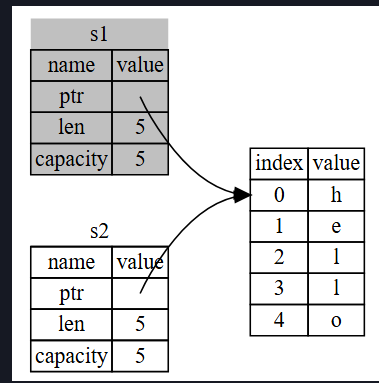
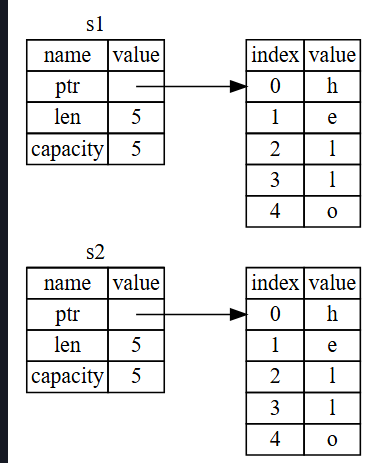

# Cour : **OwnerShip**

## 1.**Introduction – La gestion de la mémoire dans les langages de programmation**

### 1.1. **Gestion traditionnelle : malloc/free ou garbage collector**

-   **Langages comme C / C++** :

    -   L’allocation et la libération de mémoire se font **manuellement** avec `malloc/free` ou `new/delete`.
    -   ⚠️ Problèmes fréquents : fuites mémoire, accès à des pointeurs invalides, double free, etc.

-   **Langages comme Java / Python / C#** :

    -   Utilisent un **garbage collector (GC)**.
    -   Le programme n’a pas à gérer explicitement la mémoire : le GC détecte les objets non utilisés et les libère.
    -   ✅ Facilité, mais ❌ coût en performance (GC = pause, surcoût CPU).

### 1.2. Une nouvelle approche avec Rust : **Ownership**

-   Rust propose une approche **sans garbage collector** ni gestion manuelle de la mémoire.
-   Il repose sur un **système d’ownership** vérifié **à la compilation**.
-   ✅ Avantages :
    -   Sécurité mémoire garantie **à la compilation**.
    -   Pas de surcoût d’un GC.
    -   Prévention automatique des erreurs de mémoire (double free, use after free, etc.).

## **2. Stack et Heap**

### 2.2. **Stack (Pile):**

-   Mémoire rapide utilisée pour stocker :

    -   les variables de taille connue à la compilation (ex: `i32`, `bool`, etc.),
    -   les appels de fonctions.

-   ⚡ Très rapide car allocation/désallocation est automatique (type LIFO).

-   **Exemple :**

    ```rust
    fn main() {
        let x = 5; // Stocké dans la stack
    }
    ```

### 2.2. **Heap (Tas):**

-   Utilisé pour les données de **taille dynamique** ou inconnue à la compilation.
-   Allocation manuelle (à travers `Box`, `Vec`, `String`, etc.)
-   Plus lent : nécessite un pointeur, donc un accès indirect.
-   Rust s'assure que tout objet sur le heap a **un unique propriétaire**.

```rust
fn main() {
    let s = String::from("Hello"); // `s` pointe vers des données dans le heap
}
```

## 3.**Les règles d’Ownership en Rust**

-   **Règle 1 et 2: Chaque valeur a un unique propriétaire**

    ```rust
    fn main() {
        let s1 = String::from("hello");
        let s2 = s1; // Ownership déplacé ! (s1 est invalidé)

        // println!("{}", s1); ❌ Erreur : valeur "empruntée" par s2
        println!("{}", s2); // ✅
    }
    ```

    -   Ici, `s1` donne la propriété de la valeur à `s2`.
    -   À la compilation, Rust invalide `s1`.

-   **Règle 3 : Une valeur est libérée quand son owner sort de scope**

    ```rust
    fn main() {
        {
            let s = String::from("hello");
            // `s` est valide ici
        }
        // `s` est automatiquement libéré ici
    }
    ```

    -   Pas besoin de `free()` : Rust le fait pour toi quand le propriétaire sort du scope.

## 4. **Move, Clone, Copy**

-   Rust gère la mémoire de manière sûre via le **concept de "Move"**, et parfois autorise la **copie** implicite (`Copy`) ou explicite (`clone()`).

### 4.1 Le **Move** (déplacement de propriété)

> En Rust, un move est le transfert de propriété (ownership) d’une valeur d’une variable à une autre, sans effectuer de copie des données.

-   **Concrètement :**

    -   Lorsqu'une valeur est assignée à une autre variable, ou passée en argument à une fonction, l'ownership est déplacée (moved).

    -   La variable source devient invalide après le move.

    -   Cela permet à Rust de garantir que chaque valeur n’a qu’un seul propriétaire à la fois, évitant les doubles libérations.

-   **Exemple:**

    ```rust
    fn main() {
        let s1 = String::from("hello");
        let s2 = s1; // MOVE : s1 est invalidé, s2 devient le nouveau propriétaire

        // println!("{}", s1); ❌ Erreur : s1 n'est plus valide
        println!("{}", s2);  // ✅
    }
    ```

    -   `String` est stockée sur le **heap**, et possède un destructeur.
    -   Pour éviter une double libération, Rust désactive `s1` après l’assignation.
    -   Cela s’appelle un **move**.



### 4.2 Le **Clone** (copie profonde)

> En Rust, clone est une méthode qui permet de créer une copie complète et indépendante d’une valeur, y compris des données stockées sur le heap.

-   Pour créer une **copie indépendante** d’une valeur, on utilise `clone()` :

    ```rust
    fn main() {
        let s1 = String::from("hello");
        let s2 = s1.clone(); // Copie complète du contenu sur le heap

        println!("{}", s1); // ✅ Toujours valide
        println!("{}", s2); // ✅
    }
    ```

    -   `clone()` est explicite car elle est potentiellement **coûteuse** (copie mémoire sur le heap).
    -   Cela demande que le type implémente le **trait `Clone`**.



### 4.3 Le **trait `Copy`** (copie légère sur la stack)

-   Certains types simples (comme les nombres) sont automatiquement **copiés** lors d’un assignement :

    ```rust
    fn main() {
        let x = 5;
        let y = x; // Copie légère
        println!("x = {}, y = {}", x, y); // ✅ les deux sont valides
    }
    ```

    -   `i32`, `bool`, `char`, `f64`, etc. implémentent le trait `Copy` (et aussi `Clone`).
    -   La copie est **rapide et triviale** car tout est stocké dans la **stack**.

-   ⚠️ Si un type implémente `Drop` (comme `String`), il **ne peut pas être `Copy`**.

## 5. le **transfert d’ownership (move)**

> En Rust, le **transfert d’ownership (move)** peut se produire dans **trois situations principales** :

-   **Par affectation**

    Lorsque tu fais :

    ```rust
    let s1 = String::from("hello");
    let s2 = s1; // ⬅️ MOVE : s1 est invalidé, s2 devient propriétaire
    ```

    > 👉 Le contenu de `s1` est déplacé vers `s2`. `s1` n’est plus utilisable après.

-   **Par passage en argument à une fonction**

    ```rust
    fn take_ownership(s: String) {
        println!("{}", s);
    }

    fn main() {
        let s = String::from("hello");
        take_ownership(s); // ⬅️ MOVE : s est déplacé dans la fonction
        // println!("{}", s); // ❌ Erreur : s n'est plus valide ici
    }
    ```

    > 👉 L’ownership est transférée au paramètre de la fonction. La variable d’origine devient invalide.

-   **Par retour de fonction**

    ```rust
    fn give_ownership() -> String {
        let s = String::from("hello");
        s // ⬅️ MOVE : s est retourné et transféré au code appelant
    }

    fn main() {
        let s1 = give_ownership(); // ⬅️ s1 devient propriétaire
        println!("{}", s1);
    }
    ```

    > 👉 Une fonction peut **renvoyer l’ownership** d’une valeur à son appelant.
