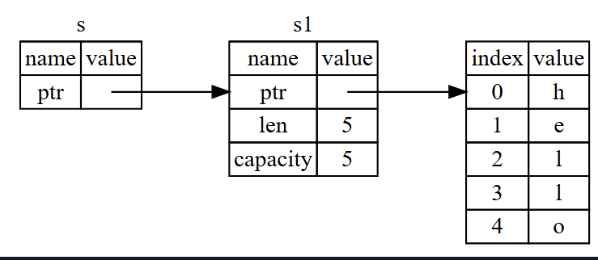

# Cour 09 : **Borrowing et Références**

## 1. **Références en Rust :**

-   **Définition:**

    > Une **référence** (`&T` ou `&mut T`) permet **d'accéder à une valeur sans en prendre l'ownership**.

    > Elle agit comme un **pointeur sécurisé** qui garantit l’intégrité de la mémoire.



-   **Syntaxe:**

    ```rust
    let x = 5;
    let r = &x; // r est une référence à x
    ```

    -   `&x` : emprunt (borrowing) immuable de `x`
    -   `&mut x` : emprunt mutable (si `x` est mutable)

-   **Exemple**

    ```rust
    fn main() {
        let s = String::from("hello");
        let r = &s;
        println!("{}", r); // ✅ accès via la référence
    }
    ```

-   **Remarque : portée d’une référence**

    > La **portée (scope)** d’une référence commence **à sa création** et se termine **à sa dernière utilisation**.

    Rust utilise cette portée pour appliquer les règles de sécurité.

    ```rust
    fn main() {
        let s = String::from("hello");

        let r = &s;       // début du scope de r
        println!("{}", r); // fin du scope de r ici

        let r2 = &s;      // ✅ OK, r n'est plus utilisé, on peut en recréer
    }
    ```

## 2. **Borrowing en Rust**

-   **Définition:**

    > Le **borrowing** est le mécanisme par lequel on **prête l'accès** à une variable **sans transfert d’ownership**.

-   Ce mécanisme permet :

    -   de lire ou modifier des valeurs,
    -   sans risque de double libération ou fuite mémoire.

-   **Syntaxe**

    | Type             | Syntaxe  | Description                   |
    | ---------------- | -------- | ----------------------------- |
    | Emprunt immuable | `&x`     | Lecture uniquement            |
    | Emprunt mutable  | `&mut x` | Lecture + écriture (exclusif) |

-   **Exemple :** fonction qui emprunte

    ```rust
    fn print_length(s: &String) {
        println!("Length: {}", s.len());
    }

    fn main() {
        let s = String::from("hello");
        print_length(&s); // borrowing sans transfert
        println!("{}", s); // s est toujours valide
    }
    ```

## 3. **Règles du Borrowing:**

> Rust applique **3 règles fondamentales** :

-   **Règle 1 : plusieurs références immuables autorisées**

    ```rust
    let s = String::from("data");
    let r1 = &s;
    let r2 = &s; // ✅ plusieurs emprunts immuables
    println!("{}, {}", r1, r2);
    ```

-   **Règle 2 : une seule référence mutable autorisée**

    ```rust
    let mut s = String::from("data");
    let r = &mut s; // ✅ OK
    r.push_str(" updated");
    ```

-   **Règle 3 : Pas de mélange entre `&` et `&mut`**

    ```rust
    let mut s = String::from("data");

    let r1 = &s;
    let r2 = &mut s; // ❌ Erreur : emprunt mutable alors qu’un emprunt immuable existe
    ```

    > 🧠 Ceci évite les **data races** et garantit la **cohérence des accès**.

## 4. **Data races:**

-   Définition **Data Race**

    > Une **data race** arrive quand **deux parties du programme modifient une même variable en même temps** sans se coordonner → résultat **incohérent ou inattendu**.

-   **Une data race survient lorsqu’au moins deux threads :**

    -   Accèdent à une même zone mémoire,

    -   Au moins un des accès est en écriture,

    -   Et il n’y a pas de synchronisation entre ces accès (mutex, lock, etc.).

-   **Exemple du data race en cpp:**

    ```cpp
    #include <iostream>
    #include <thread>

    int x = 0;

    void f1() { x += 1; }
    void f2() { x += 1; }

    int main() {
        std::thread t1(f1);
        std::thread t2(f2);

        t1.join();
        t2.join();

        std::cout << "x = " << x << std::endl;
    }
    ```

-   **Pourquoi Rust interdit ça ?:**

    > En Rust : **pas de deux `&mut` en même temps**

    -   Rust **interdit** d’avoir deux références mutables (`&mut`) à la même variable **en même temps**, **même dans une seule fonction** :

    ```rust
    fn main() {
        let mut x = 10;

        let p1 = &mut x;
        let p2 = &mut x; // ❌ Erreur à la compilation !

        *p1 += 1;
        *p2 *= 2;
    }
    ```

    > 💥 **Erreur du compilateur** : « cannot borrow `x` as mutable more than once at a time »

## 5. **Dangling References (Références pendantes):**

-   **Définition:**

    > Une **dangling reference** est une référence à une **valeur supprimée ou invalide**

    ```c
    char* dangle() {
        char local[] = "hello";
        return local; // ❌ Dangling pointer : local sera supprimée
    }
    ```

-   **Comment Rust empêche ça:**

    Rust détecte ce cas **à la compilation** :

    ```rust
    fn dangle() -> &String {
        let s = String::from("hello");
        &s // ❌ Erreur : s va être supprimée
    }
    ```

    > 🧱 Rust interdit le retour de référence à une variable qui sera supprimée — sécurité garantie à **compile-time**.
